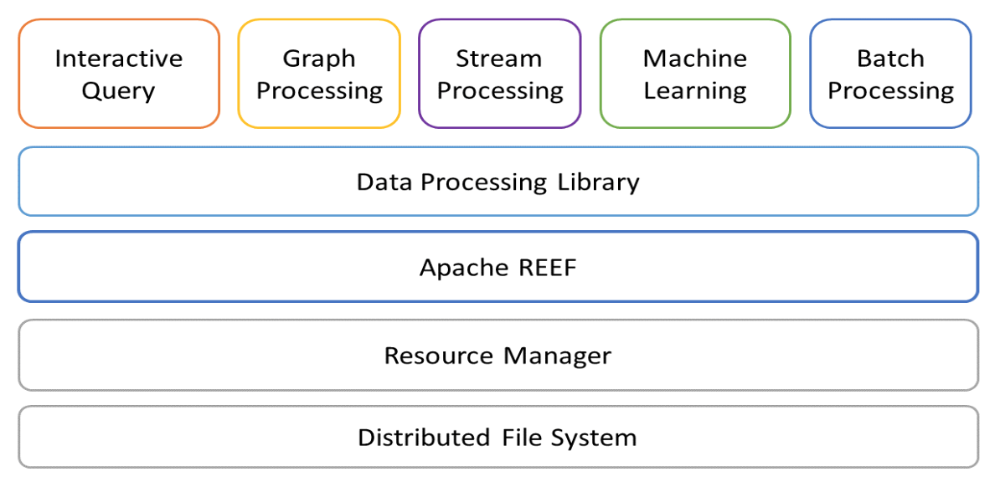

Apache REEF (Retainable Evaluator Execution Framework) is a library that simplifies development of applications running on cluster resource managers. REEF is an Apache Software Foundation (ASF) Top-Level Project (TLP) and being actively developed by research teams in Seoul National University and Microsoft.

REEF is a layer that provides a convenient environment for developing big data applications on resource managers such as Apache YARN and Apache Mesos. It facilitates development and management of data processing services on a distributed data analytics environment. By efficiently managing resources, REEF is capable of expeditious big data processing for machine learning, graph processing, and stream processing.

REEF facilitates integration between data processing applications and existing big data frameworks. Integrating different frameworks and optimizing data processing workflow between them reduce the cost of analytic jobs. In recognition of these benefits, REEF is being used in Microsoft as a core technology in its cloud computing service, Microsoft Azure. Besides Microsoft, REEF is being adopted in various projects of companies and research institutes.