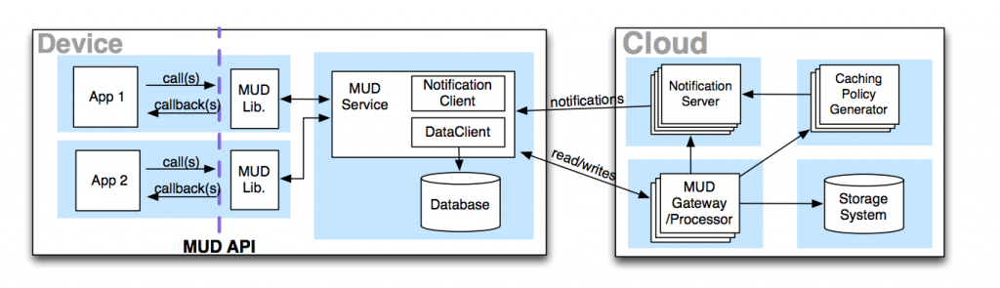

Mobius & CloneCloud  

<b>Mobius:</b> Mobile application development is challenging for several reasons: intermittent and limited network connectivity, tight power constraints, server-side scalability concerns, and a number of fault tolerance issues. Developers handcraft complex solutions that include client-side caching, conflict resolution, disconnection tolerance, and backend database sharding. To simplify mobile app development, I have developed Mobius, which introduces MUD (Messaging Unified with Data). MUD presents the programming abstraction of a logical table of data that spans devices and clouds. Applications using Mobius can asynchronously read from/write to MUD tables. Applications can also receive notifications when tables change via continuous queries on the tables. The system combines dynamic client-side caching (with intelligent policies chosen on the server-side, based on usage patterns across multiple applications), notification services, flexible query processing, and a scalable and highly available cloud storage system.

<b>CloneCloud:</b> CloneCloud addresses smartphones’ hardware limitations via seamlessly but partially offloading execution via thread migration from the smartphone to a computational infrastructure hosting a cloud of smartphone clones. The execution between a mobile device and the cloud is elastic and is optimized to improve performance or energy consumption by combining static analysis, dynamic profiling, and cost optimization. Specifically, CloneCloud improves the performance of applications from resource-starved devices such as smartphones, by opportunistically offloading them to available cloud resources in nearby datacenters or cloudlets. The system can support very expensive operations (e.g., image search, virus scanning, and data leak detection) (a) without requiring application designers to explicitly plan for cloning, (b) without draining the smartphone’s battery power, and (c) with significant performance improvement. Our evaluation shows that CloneCloud can adapt application partitioning to different environments, and it helps some applications achieve as much as a 20x execution speed-up and a 20-fold decrease of energy spent on the mobile device.

<b>Publication:</b>
<li>B.-G. Chun, C. Curino, R. Sears, A. Shraer, S. Madden, and R. Ramakrishnan. “Mobius: Unified messaging and data serving for mobile apps,” In ACM MobiSys, 2012.</li>
<li>B.-G. Chun, S. Ihm, P. Maniatis, M. Naik, and A. Patti. “CloneCloud: Elastic execution between mobile device and cloud,” In ACM EuroSys, 2011.</li>
<li>B.-G. Chun and P. Maniatis. “Augmented smart phone applications through clone cloud execution,” InUSENIX HotOS, 2009.</li>
